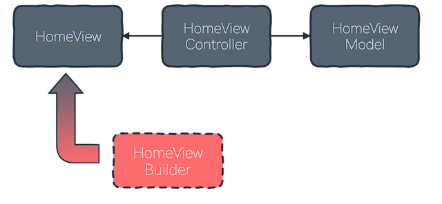

# FunctionalBuilders

A template for building views in **functional** way described in article.

## Idea 

Introducing **ViewBuilders** instead of using storyboards. Example **MVVM+VB** architecture:

<p align="center">
  
</p>

Generally the idea of **ViewBuilders** is to separate installing and setting up view to small functions and create one function that contatenates them all in flow. 

```swift

public static func buildView(withFrame frame: CGRect) -> HomeView {
   let homeView = HomeView(frame: frame)
   
   return Builder(view: homeView)
   	|> setupBackgroundColor
   	|> installLabelsStackView
   	|> installNameLabel
   	|> installAgeLabel
   	|> installCityLabel
   	|> endEditing
}
```

## Gain?

- Flow - we control step by step the process of building a view 
- Possibility to make view building generic 
- Clean structure 
- Constraints

## Constraints 

This framework also makes installing constraints easier, and more functional, like: 

```swift
stackView.constraintBuilder
	|> centerY(source: builder.view.centerYAnchor)
	|> leading(source: builder.view.safeAreaLeadingAnchor, constant: 15.0)
	|> trailing(source: builder.view.safeAreaTrailingAnchor, constant: 15.0)
	|> height(constant: 200.0)
	|> activate
```

It looks more like flow-composed set of functions, we once set the destination view (the one that we’re setting up) and pass only source for the constraints generating functions. Please look at functions definitions for more details, but generally it is possible to pass constraints relation and priorities. 

### Project Status

The project is under development now. It is not ready to use in production yet. We are drafting the idea now. Won't reccomend using it in production before we make our code well tested.

### Contribution

If you have any ideas how to make **FunctionalBuilders** better or found, fixed bugs please create a Pull Request.

### License

FunctionalBuilders is released under an MIT license. See [License.md](LICENSE.md) for more information.
